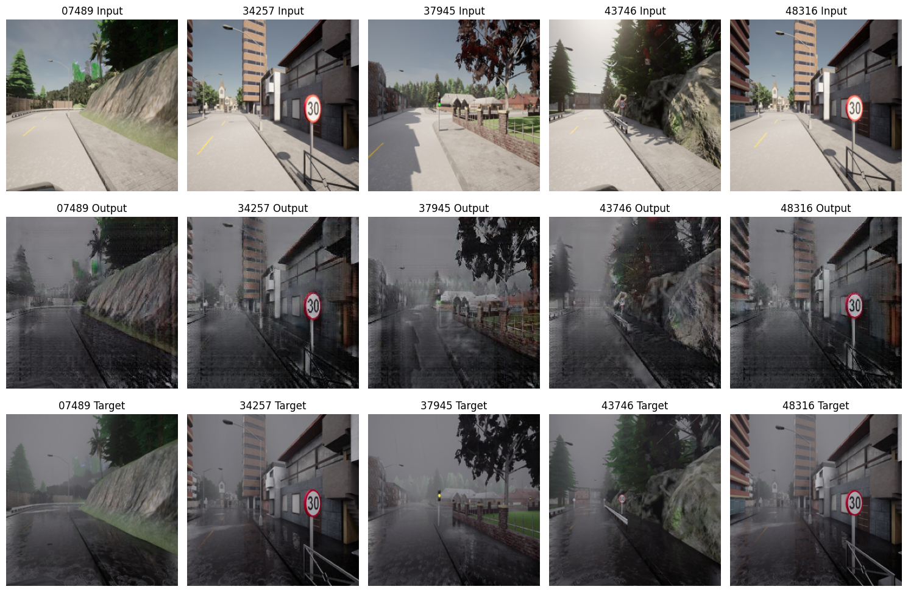

# Data-Augmentation-using-GANs

In this repository you will find a notebook giving you an CycleGAN and Pix2Pix approach for translating an image from a Domain $X$ to a Domain $Y$. 

<figure style="text-align: center;">
  
</figure>

This repository is for educational purposes only and was part of a project at Chemnitz University of Technology to investigate whether image-to-image translation could be a valuable technique for data augmentation. Thanks to IAV Chemnitz for suggesting this topic and to TU Chemnitz for supervising.
